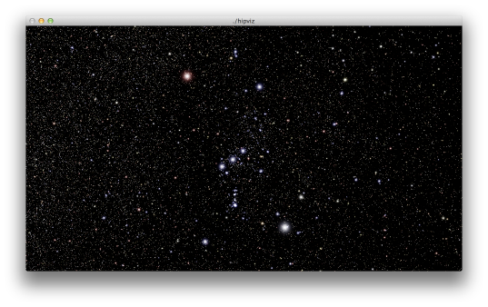

# Hippo

Hippo provides a spatial index for 3D star catalogs enabling high-performance neighborhood and visibility determination. It includes functions to ingest raw Hipparcos data and serialize it to a binary RIFF file. An example application demonstrates the real-time 3D visualization of this data.

Hippo is implemented as a simple C module:

- [`hippo.c`](hippo.c)
- [`hippo.h`](hippo.h)

Each star is stored with a very limited number of fields, chosen primarily for simple star field rendering. The `pos` field gives the 3D position of the star in light years. The `mag` gives the B-band and V-band magnitude of the star.

    struct star
    {
        float pos[3];
        float mag[2];
    };

    typedef struct star  star;

These fields suffice to compute the apparent magnitude of a star (V - 0.09 (B - V)), the absolute magnitude (given its position), and thus the apparent magnitude at any point in space. Additionally, the color index may be computed (0.85 (B - V)) and used to determine the spectral type and apparent color of each star.

A star catalog and its spatial index is represented using an opaque `hippo` structure.

- `typedef struct hippo hippo;`

There are several functions that operate upon this structure.

- `hippo *hippo_read(const char *filename)`

    Read a star catalog in RIFF format from the file named `filename`. Return a `hippo` structure, or `NULL` on failure. For efficiency, this function memory-maps the RIFF, so it will remain open until freed.

- `int hippo_write(hippo *H, const char *filename)`

    Write a star catalog in RIFF format to the file name `filename`. Return 0 on failure.

- `void hippo_free(hippo *H)`

    Release a `hippo` structure, free all memory that it uses, and close any open RIFF file.

- `const star *hippo_data(const hippo *H)`

    Return the full array of stars in the catalog.

- `uint32_t hippo_size(const hippo *H)`

    Return the number of stars in the catalog.

The following functions enable efficient query of a star catalog.

- `void hippo_seek(const hippo *H, const float *v, int c, hippo_seek_fn fn)`

    Call the given call-back function `fn` with each list of stars that falls within the volume bounded by the array of `c` planes at `v`. Each plane is given in the form of the four parameters (a, b, c, d) of the plane equation ax + by + cz + d = 0, so `v` is assumed to have length `4 * c`.

    In all likelihood, `fn` will be called many times for each invocation of `hippo_seek`. Depending upon the granualarity of the spatial index (the depth of subdivision specified when the catalog was ingested) there is a small possibility of stars *not* within the specified volume appearing in the returned lists. However there is no possibility of a star within the specified volume *not* appearing in at least one list.

    The call-back function has the following signature. The argument `v` will be a pointer to an array of stars, and `c` will give the number of stars in that array. This array will be a subset of the full array given by `hippo_data`.

        typedef void (*hippo_seek_fn)(const star *v, uint32_t c);

    The [`hipviz.cpp`](hipviz.cpp) example demonstrates the use the `hippo_seek` for determining star visibility in a real-time 3D star catalog renderer.

- `void hippo_view_bound(float *v, const float *M)`

    Generate a set of six planes corresponding to the bounds of the view volume defined by the 4 &times; 4 model-view-projection matrix `M`. The array `v` must accommodate 24 floating point values. This is a convenience function useful for determining the set of currently visible stars.

- `void hippo_cube_bound(float *v, const float *p, float d)`

    Generate a set of six planes corresponding to the bounds of the cubic volume centered at the 3D position `p`, extending `d` light years in all directions. The array `v` must accommodate 24 floating point values. This is a convenience function useful for determining the set of stars neighboring any point in space.

The following two functions enable the ingestion of raw stellar data from archival sources. These functions are called by the [`hipgen`](hipgen.cpp) utility. They are not generally needed by the end user, as RIFF files of both [Hipparcos](http://cct.lsu.edu/~rkooima/hippo/hipparcos.riff) and [Tycho-2](http://cct.lsu.edu/~rkooima/hippo/tycho.riff) are made available here.

- `hippo *hippo_read_hip(const char *filename, uint32_t d)`

    Read a star catalog in [Hipparcos main catalog format](ftp://cdsarc.u-strasbg.fr/pub/cats/I/239/ReadMe) from the file named `filename`. Generate a spatial index with depth `d`. Return `NULL` on failure. The [Strasbourg Astronomical Data Center](http://cdsweb.u-strasbg.fr) provides the complete Hipparcos catalog in the gzipped file `hip_main.dat` [here](ftp://cdsarc.u-strasbg.fr/pub/cats/I/239).

- `hippo *hippo_read_tyc(const char *filename, uint32_t d)`

    Read a star catalog in [Tycho-2 main catalog format](ftp://cdsarc.u-strasbg.fr/pub/cats/I/259/ReadMe) from the file named `filename`. Generate a spatial index with depth `d`. Return `NULL` on failure. Because Tycho-2 records do not include trigonometric parallax, the distance to these stars is not known and the their 3D position cannot be calculated. Instead, they are positioned at a distance of 10 parsecs from the origin, where absolute magnitude equals apparent magnitude. The [Strasbourg Astronomical Data Center](http://cdsweb.u-strasbg.fr) provides the complete Tycho-2 catalog in the segmented gzipped file `tyc2.dat` [here](ftp://cdsarc.u-strasbg.fr/pub/cats/I/259).
